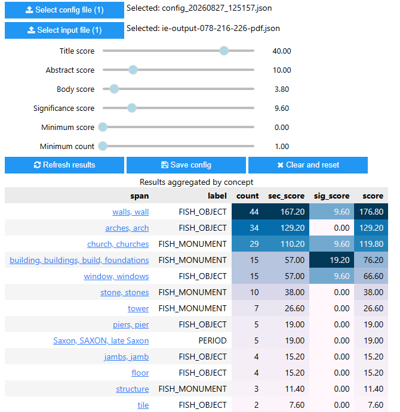

# Information Extraction Results Viewer 

- [Introduction](#introduction)
- [Getting started](#getting_started)
- [Usage](#usage)
- [Results display](#results_display)

# Introduction 
Viewer for Information Extraction results on OASIS reports. This was developed as part of the [ATRIUM project](https://atrium-research.eu/). The viewer facilitates interactive experimental adjustment of section and significance scores to affect results ranking. These scores can also be used in the configuration of the `SpanScorer` pipeline element to adjust the way that results are ranked in subsequent runs of the information extraction process. The viewer is developed as a Python notebook which can be run and interacted with using [Binder](https://mybinder.org). 

[[back to top]](#top)

# Getting started 
To access the viewer, click the `launch binder` link (below). Note: Initially the build process may take a few minutes before the main interface is displayed, however subsequent usage should be quicker. 

Once built and opened, select `Run` > `Run all cells` from the main menu to run the code to set up the viewer. The user interface should now be displayed towards the bottom of the page (you may need to scroll down to see it): 

<figure>
    
    <figcaption>Information Extraction results viewer</figcaption>
</figure>

[[back to top]](#top)

## Usage 
Click the `Select input file` button to select a JSON results file to process - these results files need to be located in a local folder acessible to you (i.e. not on an external Google drive or similar). After a short delay the selected file name will be displayed to the right of the button, indicating the file has been successfully loaded. Click the `Refresh results` button to display a table of aggregated concept scores in descending score order. Adjusting the various score sliders and selecting `Refresh results` will update the results table using the new values. This may change the ranking of results in the table. Adjusting the `minimum score` and/or `minimum count` sliders and selecting `Refresh results` will filter the results table accordingly. The selected slider values can optionally be saved to a JSON config file to be loaded again later and for producing future Information Extraction results wusing the same chosen configuration parameters.

[[back to top]](#top)

## Results display 
The results table is displayed in descending score order and the column values are highlighted using a gradient (where darkest = highest value) to visually distinguish the relatively higher scores in each column. The columns displayed are as follows:

* **span** - the text of the identified concept. There may be multiple variations found, if so they will be displayed as a comma delimited string. If associated with a Linked Open Data concept it will be displayed as a link with a URI to that concept.
* **label** - the 'type' of concept identified. This usually equates to the originating vocabulary of the concept e.g. FISH_OBJECT (concept from FISH Archaeological Objects thesaurus), FISH_MONUMENT (concept from FISH Thesaurus of Monument Types), PERIOD (concept from PeriodO gazetteer).
* **count** - overall number of instances of the concept identified in the original document text.
* **sec_score** - the overall sum of *section scores* for the concept. Concepts may occur with the title, abstract or body of the document. You can adjust the score contribution for each of these by changing the `title score`, `abstract score` or `body score` sliders respectively.
* **sig_score** - the overall sum of *significance scores* (the concept being in close proximity to a 'significance' indicator in the text). You can adjust the score contribution using the `significance score` slider.
* **score** - the overall score for the concept (calculated as **sec_score** + **sig_score**)

[[back to top]](#top)
